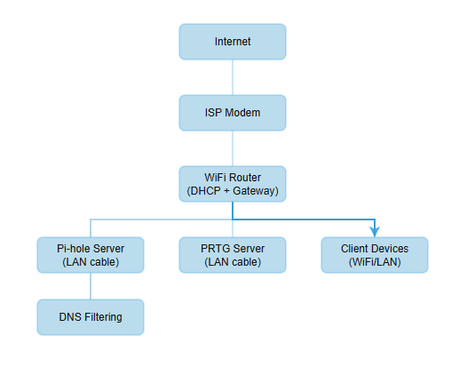

# Home Network Monitoring & DNS Security

Triển khai hệ thống giám sát mạng gia đình, lọc DNS và cảnh báo sự cố qua Telegram.

----------------------------------------------------------------------------------------

Giới thiệu dự án

Dự án xây dựng một hệ thống giám sát và bảo mật mạng gia đình bằng cách kết hợp:
- Network Monitoring
- DNS Filtering
- Dashboard 
- Alert Notification

-----------------------------------------------------------------------------------------

Mục tiêu của dự án
- Giám sát trạng thái thiết bị mạng
- Phát hiện sự cố hệ thống
- Chặn quảng cáo và tracking domain
- Hiển thị dashboard giám sát trực quan
- Gửi cảnh báo tự động khi hệ thống gặp sự cố

----------------------------------------------------------------------------------------

Công nghệ sử dụng

Pi-hole – DNS filtering & ad blocking
PRTG Network Monitor – Network monitoring
Telegram Bot – Alert notification

----------------------------------------------------------------------------------------

Thiết bị và cấu hình tối thiểu

## Pi-hole 
Raspberry Pi 3 Model B trở lên
CPU: Quad-core 1.2 GHz
RAM: 1GB
Storage: microSD ≥ 8GB

## Máy Monitoring
CPU	Intel Core i3 hoặc tương đương
RAM	4 GB
Ổ cứng	50 GB
Mạng 1 Gbps Ethernet

----------------------------------------------------------------------------------------

Kiến trúc hệ thống

  

----------------------------------------------------------------------------------------

Ví dụ cảnh báo Telegram

⚠ Network Alert
Device: Pi-hole Server
Status: DOWN
Time: 22:40

