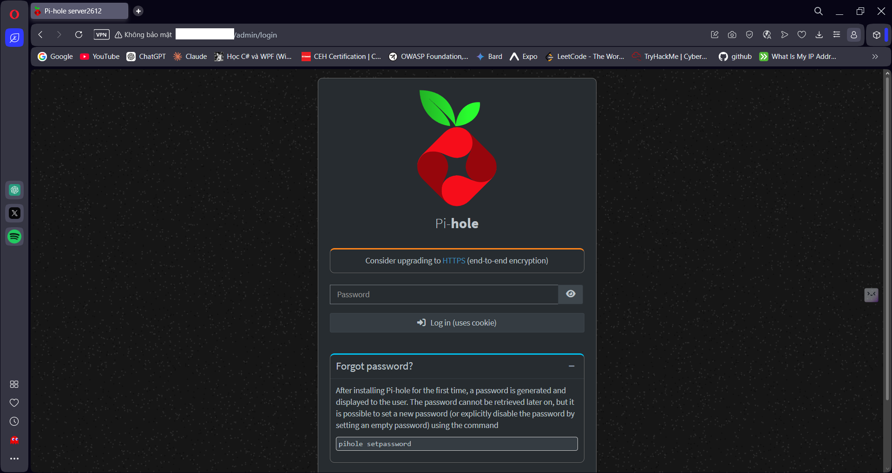
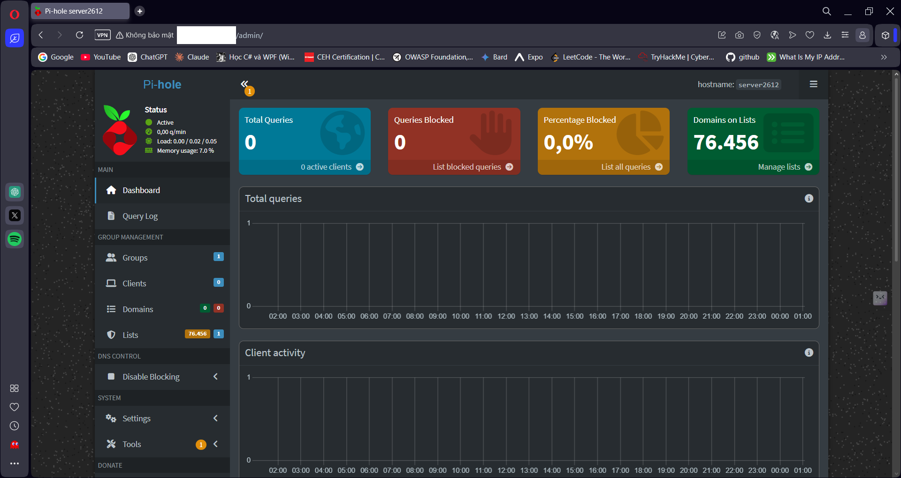
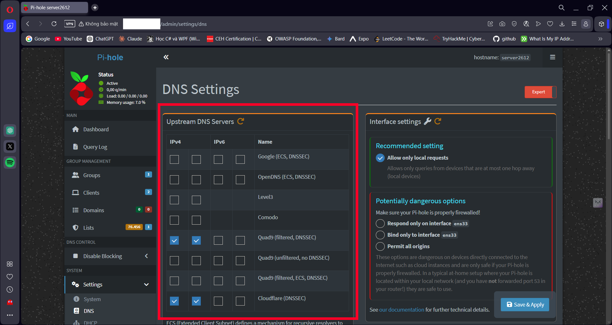
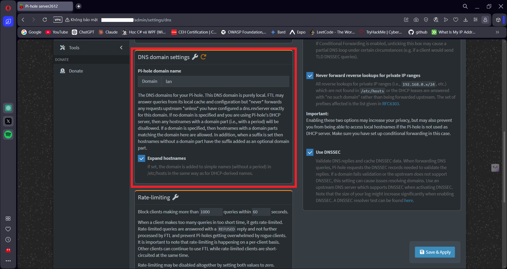
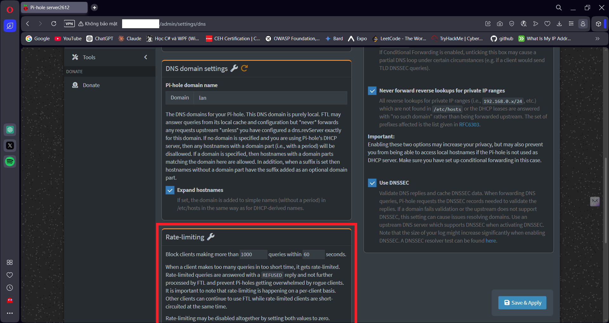
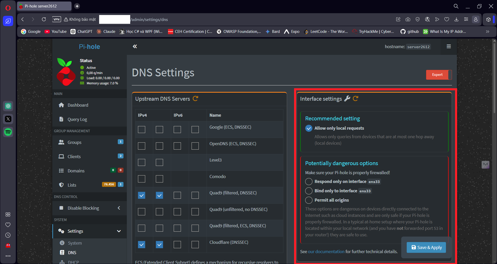
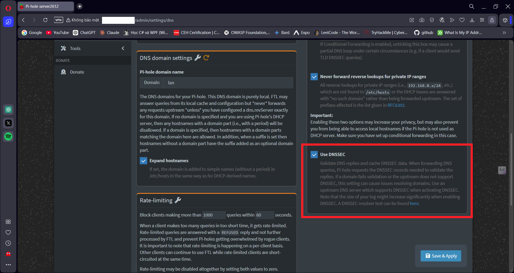
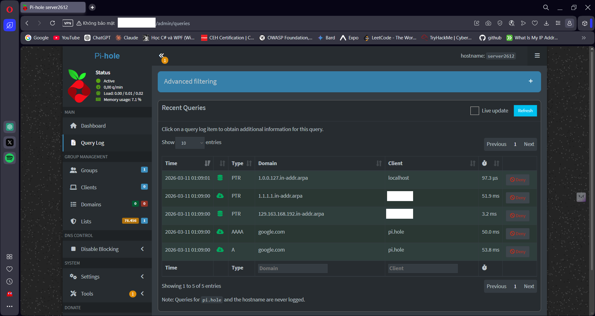
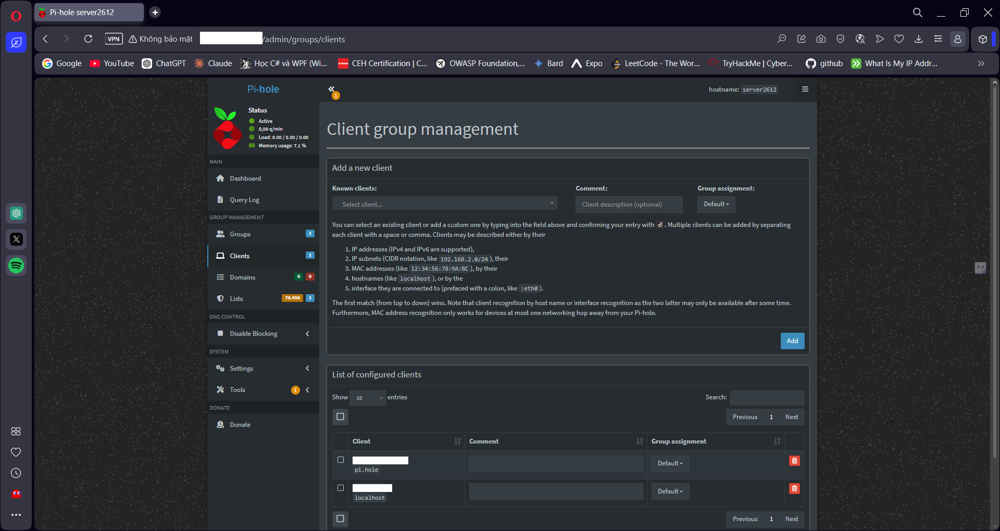

# Đăng nhập

# Dashboard
Sau khi đăng nhập, ta vào được trang dashboard

# 1. Upstream DNS Servers

Khuyến nghị sử dụng Cloudflare DNS hoặc Quad9 DNS.

Cấu hình phổ biến (khuyên dùng)

Tick:

Cloudflare (DNSSEC)

IPv4 DNS:

1.1.1.1
1.0.0.1

Lý do:

	+ tốc độ rất nhanh

	+ bảo vệ quyền riêng tư tốt

	+ độ ổn định cao

	+ Screenshot:

Cấu hình bảo mật cao hơn

Tick:

Quad9 (filtered, DNSSEC)

DNS:

9.9.9.9
149.112.112.112

Quad9 có malware filtering giúp chặn domain độc hại.

## Lưu ý

Không nên chọn quá nhiều upstream DNS cùng lúc.

Chỉ nên:

1 – 2 upstream DNS server

# 2. Pi-hole Domain Name

Giữ mặc định:

lan

Thiết bị trong mạng sẽ có dạng:

laptop.lan
phone.lan
printer.lan

Điều này rất hữu ích để dễ dàng quan sát và bảo trì hơn.

# 3. Expand Hostnames

Bật:

Enable

Pi-hole sẽ tự động hiển thị hostname dạng:

hostname.lan

Thay vì chỉ hiển thị IP.

# 4. Rate Limiting

Giữ mặc định:

1000 queries
60 seconds

Mục đích:

chống spam DNS

tránh DNS flooding

Không cần thay đổi.

# 5. Interface Settings

Chọn:

Allow only local requests

Đây là setting an toàn nhất .

Không nên chọn:

Permit all origins

Vì sẽ biến Pi-hole thành:

Open DNS Resolver

→ dễ bị abuse.

# 6. Advanced DNS Settings

Khuyến nghị bật:

Never forward non-FQDN queries
Never forward reverse lookups for private IP ranges

Lợi ích:

tăng privacy

giảm query rác

tối ưu DNS resolution

# 7. DNSSEC

Bật:

Enable DNSSEC

DNSSEC giúp:

chống DNS Spoofing

xác thực DNS response

Lưu ý: chỉ bật khi upstream DNS hỗ trợ DNSSEC.

Các DNS hỗ trợ:

Cloudflare

Quad9

# 8. Query Log 

Ví dụ query trong Pi-hole:

doubleclick.net  → blocked
google.com       → allowed
facebook.com     → allowed

# 9. Network Clients

Ví dụ các thiết bị trong mạng:

192.168.1.5  laptop.lan
192.168.1.6  phone.lan
192.168.1.7  tv.lan

Tính năng này giúp:

theo dõi thiết bị

kiểm tra DNS traffic

phát hiện thiết bị bất thường

